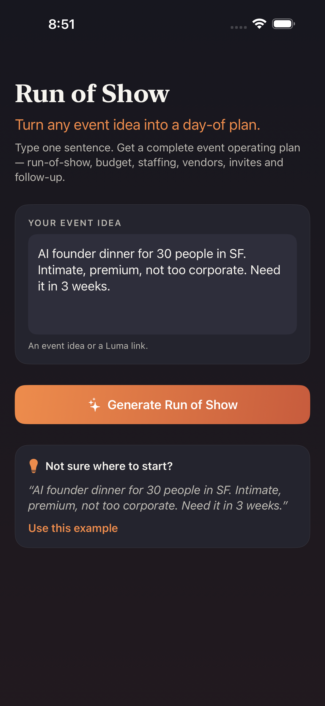
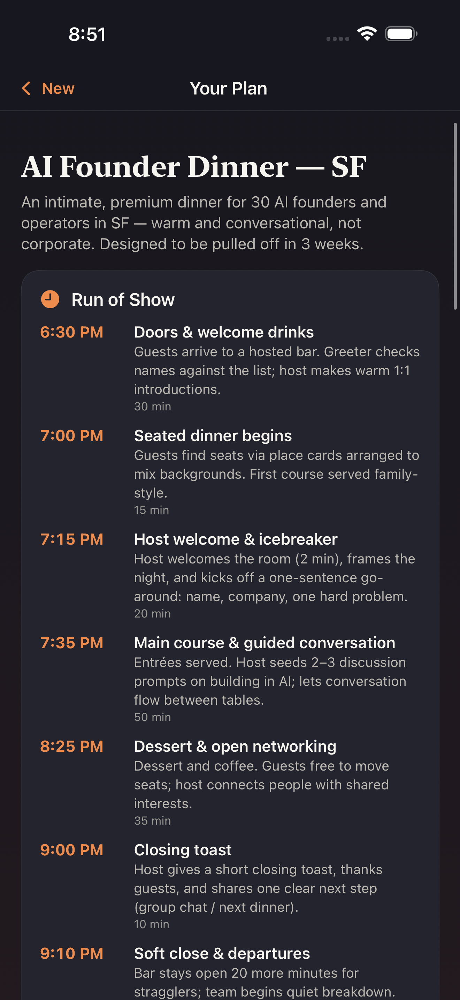

# Run of Show

**Turn any event idea into a day-of plan.**

> I typed one sentence and it planned my entire event.

Run of Show is a native **iOS app (Swift / SwiftUI)** that turns a single sentence —
or a Luma link — into a complete event operating plan. One input, one button, and
you get a full, ready-to-run document: the minute-by-minute run-of-show, venue
requirements, a costed budget, ready-to-send invite copy, a staffing plan, a vendor
checklist, the day-of logistics timeline, and a post-event follow-up plan.

It is built for event operators, field marketers, community leads, and founders who
are responsible for real-world experiences and want to feel: *"I can actually pull
this event off."*

---

## What it does

You type one thing, e.g.:

> "AI founder dinner for 30 people in SF. Intimate, premium, not too corporate. Need it in 3 weeks."

…tap **Generate Run of Show**, and the app produces eight sections, each rendered as
its own card:

| Section | What it contains |
| --- | --- |
| **Run of Show** | A minute-by-minute / segment timeline for the event itself |
| **Venue Requirements** | Capacity, ambiance, layout, A/V, catering, accessibility |
| **Budget** | Line items with estimated costs and a total |
| **Invite Copy** | Ready-to-send subject line + invitation body |
| **Staffing Plan** | Roles, headcounts, and responsibilities |
| **Vendor Checklist** | Vendors to book and exactly what to confirm |
| **Day-of Timeline** | Load-in, setup, and teardown logistics with owners |
| **Follow-up Plan** | Post-event actions and when to do them |

---

## Architecture

The project is split so that **all the important logic is verifiable on Linux**,
while the SwiftUI layer stays thin and lives on top.

```
RunOfShow/
├── Package.swift                 # Swift Package — the core engine (builds & tests on Linux)
├── Sources/RunOfShowKit/         # ◀ ALL business logic lives here
│   ├── Models.swift              #   Codable structs for every output section + the plan
│   ├── InputParser.swift         #   Parses the single text field (Luma link, headcount, …)
│   ├── PromptBuilder.swift       #   Builds system/user prompts + JSON schema
│   ├── AIProvider.swift          #   `AIProvider` protocol + request/error types
│   ├── MockProvider.swift        #   Deterministic, offline provider (tests & previews)
│   ├── ClaudeProvider.swift      #   Real Anthropic Messages API provider (URLSession)
│   ├── JSONExtractor.swift       #   Robust JSON parsing with graceful fallback
│   └── RunOfShowEngine.swift     #   High-level entry point used by the app & tests
├── Tests/RunOfShowKitTests/      # XCTest suite (runs on Linux, no network/key)
├── App/RunOfShow/                # SwiftUI app (screens, views, view model, theme)
├── AppUITests/                   # XCUITest that drives the app & captures screenshots
├── project.yml                   # XcodeGen project definition
└── .github/workflows/            # CI: Linux swift test + macOS iOS-Simulator UI tests
```

### The AI layer

- **`AIProvider`** is a protocol with one async method:
  `func generatePlan(for request: PlanRequest) async throws -> RunOfShowPlan`.
- **`MockProvider`** is fully deterministic and offline. It returns realistic content
  based on the AI-founder-dinner example, lightly adapted to the parsed headcount /
  location / timeframe. Tests and SwiftUI previews use it, and it needs **no network
  and no API key**.
- **`ClaudeProvider`** calls the real **Anthropic Messages API**
  (`https://api.anthropic.com/v1/messages`, header `x-api-key`,
  `anthropic-version: 2023-06-01`) via `URLSession`, using the current
  **`claude-sonnet-4-6`** model. It asks the model for JSON and parses it into the
  typed `RunOfShowPlan` with a robust fallback (`JSONExtractor`).

The app picks a provider automatically: if `ANTHROPIC_API_KEY` is present it uses
Claude, otherwise it falls back to the offline mock.

---

## Run the tests (Linux or macOS)

The core package builds and tests on Linux with **no network and no API key**:

```bash
swift build
swift test
```

That is the non-negotiable definition of "testable" for this project. The suite
covers: every required output section is produced from a representative input,
`Codable` round-trips for all models, prompt construction includes the user input and
all required sections, robust JSON extraction, and edge cases (empty / very short /
whitespace-only input).

---

## Open & run in Xcode (Mac + iOS Simulator)

The Xcode project is generated from `project.yml` with
[XcodeGen](https://github.com/yonaskolb/XcodeGen):

```bash
brew install xcodegen     # if you don't have it
xcodegen generate
open RunOfShow.xcodeproj
```

Then pick an iPhone simulator (e.g. iPhone 16) and hit **Run** (⌘R). A generated
`RunOfShow.xcodeproj` is also committed, so on a Mac you can simply:

```bash
open RunOfShow.xcodeproj
```

### Setting `ANTHROPIC_API_KEY`

The app never hardcodes the key — it reads `ANTHROPIC_API_KEY` from the environment.

- **In Xcode:** Product ▸ Scheme ▸ Edit Scheme… ▸ Run ▸ Arguments ▸
  *Environment Variables* → add `ANTHROPIC_API_KEY` = your key.
- **Without a key:** the app runs fully offline using `MockProvider`, so you can
  demo it with no setup.

> Never commit your API key. It is read at runtime only.

---

## Screenshots / Simulator

These screenshots are produced by the **iOS Simulator UI test** running on a macOS
GitHub Actions runner (offline, deterministic mock mode), and committed here so you
can see the real app without a Mac.

| Input screen | Generated plan (results) |
| --- | --- |
|  |  |

---

## Continuous integration

`.github/workflows/ios-simulator.yml` runs two jobs:

1. **Linux • `swift build` & `swift test`** (`ubuntu-latest`, official Swift
   container) — builds and unit-tests the core `RunOfShowKit` package.
2. **macOS • iOS Simulator UI tests** (`macos-15`) — runs `xcodegen generate`,
   builds the app for an iOS Simulator, runs the XCUITest with `-UITEST_MOCK 1`
   (offline, no key), and uploads the input + results screenshots as artifacts.

Both jobs must be green.

---

## Scope

Run of Show intentionally does **one magical thing** — the perfect event operating
plan. It does not do registration, ticketing, sponsor management, a vendor
marketplace, badge printing, or analytics.
